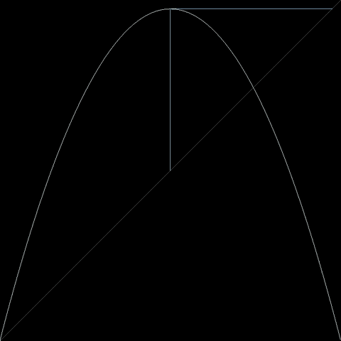
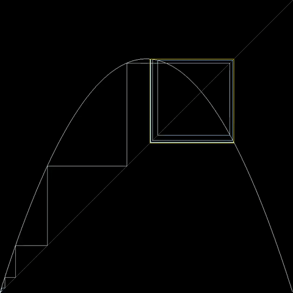
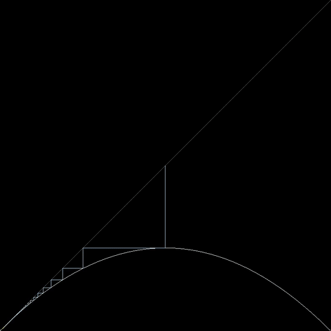

# **CPP-LogisticChaos**

**CPP-LogisticChaos** is a C++ project designed to simulate and visualize the chaotic behavior of the **Logistic Map**, a classic model in population dynamics and chaos theory.

This repository provides an efficient C++ implementation for generating time series data, bifurcation diagrams, and analyzing the onset of chaos in non-linear dynamical systems. It generates image frames which can be compiled into high-quality animations.

## **🎥 Demos**

### Tracing orbit



### Attractors



### Stable and Unstable parameters 

 


## **📖 Mathematical Background**

The Logistic Map is a polynomial mapping (equivalently, a recurrence relation) of degree 2, often cited as an archetypal example of how complex, chaotic behaviour can arise from very simple non-linear dynamical equations.

The mathematical definition is: 
$x_{n+1} = r x_n (1 - x_n)$
where:

- $x_n$ is a number between 0 and 1, representing the ratio of existing population to the maximum possible population at year $n$.


- $r$ is a positive number representing a combined rate for reproduction and starvation (growth rate).


### **Key Behaviors**

- $r < 3.0$**:** The population settles into a stable fixed point.


- $3.0 < r < 3.56995$**:** The population oscillates between 2, 4, 8, ... values (Period Doubling).


- $r > 3.56995$**:** The system enters a chaotic regime where the behavior is sensitive to initial conditions.


## **📂 Project Structure**


```
CPP-LogisticChaos/
├── src/
│   └── main.cpp        # Main application logic
├── lib/
│   ├── logistic.cpp    # Logistic map logic
│   ├── composition.cpp
│   ├── plotter.cpp     # Canvas drawing utilities
│   └── animator.cpp    # Animation logic
├── .devcontainer/      # VS Code DevContainer configuration
│   ├── devcontainer.json
│   └── Dockerfile
├── output/             # Generated frames and videos (created at runtime)
├── Makefile            # Build instructions
└── README.md           # Project documentation
```

## **🚀 Getting Started**

You can set up this project locally or use the provided VS Code DevContainer for an instant, pre-configured environment.

### **Option A: VS Code DevContainer (Recommended)**

This project is configured with a Development Container. If you use Visual Studio Code and Docker, you can open this repository in a container that comes pre-installed with **GCC**, **Make**, and **FFmpeg**.

1. Open the project in VS Code.


2. Click **"Reopen in Container"** when the popup appears (or run the command from the palette).


3. The environment will automatically install all necessary tools defined in `.devcontainer/Dockerfile`.


### **Option B: Local Installation**

If you prefer to run directly on your host machine, ensure you have the following prerequisites installed:

- **C++ Compiler:** GCC or Clang supporting C++17.

- **Make:** For building the project.

- **FFmpeg:** Required to convert the generated image frames into video files.


### **Installation**

1. **Clone the repository:**


```bash
git clone [https://github.com/JunghunLeePhD/CPP-LogisticChaos.git](https://github.com/JunghunLeePhD/CPP-LogisticChaos.git)
cd CPP-LogisticChaos
```


## **💻 Usage**

The usage consists of two steps: running the simulation to generate frames, and then compiling those frames into video files.

### **1. Run the Simulation**

Execute the following command to compile the project and run the simulation. This will generate thousands of `.ppm`image frames inside the `output/` directory.


```bash
make run
```
*Note: This process may take a few moments as it generates high-resolution frames for multiple visualizations.*

### **2. Generate Videos**

Once the simulation completes, use `ffmpeg` to create `.mp4` videos from the generated frames. You can run the following commands individually:

**Cobweb Plot Animation:**


```bash
ffmpeg -framerate 10 -i output/frames_cobweb/frame_%04d.ppm -c:v libx264 -pix_fmt yuv420p output/cobweb.mp4
```
**Time Series Strip Animation:**


```bash
ffmpeg -framerate 10 -i output/frames_strip/frame_%04d.ppm -c:v libx264 -pix_fmt yuv420p output/strip.mp4
```
**Parameter Sweep (Cobweb):**


```bash
ffmpeg -framerate 60 -i output/frames_cobweb_sweep_parameter/frame_%04d.ppm -c:v libx264 -pix_fmt yuv420p output/cobweb_sweep_parameter.mp4
```
**Parameter Sweep (Strip):**


```bash
ffmpeg -framerate 60 -i output/frames_strip_sweep_parameter/frame_%04d.ppm -c:v libx264 -pix_fmt yuv420p output/strip_sweep_parameter.mp4
```
**Bifurcation Growth:**


```bash
ffmpeg -framerate 60 -i output/frames_bifurcation_growth/frame_%04d.ppm -c:v libx264 -pix_fmt yuv420p output/bifurcation_growth.mp4
```

**Initial Point Sweep (Cobweb & Strip):**


```bash
ffmpeg -framerate 60 -i output/frame_cobweb_sweep_initial_point/frame_%04d.ppm -c:v libx264 -pix_fmt yuv420p output/cobweb_sweep_initial_point.mp4
ffmpeg -framerate 60 -i output/frame_strip_sweep_initial_point/frame_%04d.ppm -c:v libx264 -pix_fmt yuv420p output/strip_sweep_initial_point.mp4
```
## **🧹 Cleanup**

To remove the generated frames and executable to save space:

```bash
make clean
```
## **🤝 Contributing**

Contributions are welcome! Please feel free to submit a Pull Request.

1. Fork the Project

2. Create your Feature Branch (`git checkout -b feature/AmazingFeature`)

3. Commit your Changes (`git commit -m 'Add some AmazingFeature'`)

4. Push to the Branch (`git push origin feature/AmazingFeature`)

5. Open a Pull Request


## **📄 License**

Distributed under the MIT License. See `LICENSE` for more information.

Created by [*Junghun Lee, PhD*](https://www.google.com/search?q=https://github.com/JunghunLeePhD)